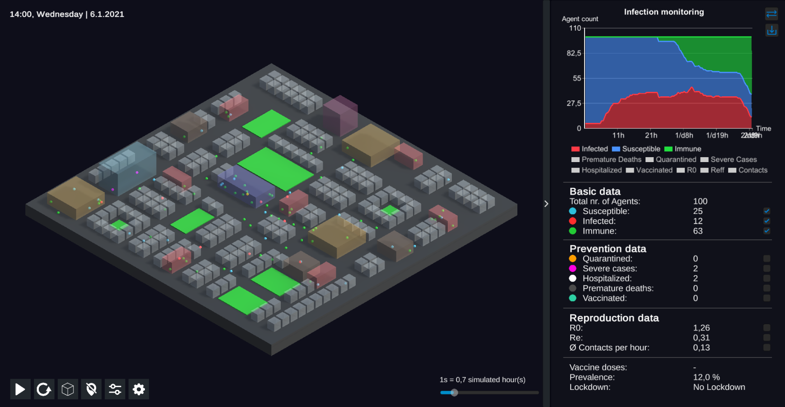
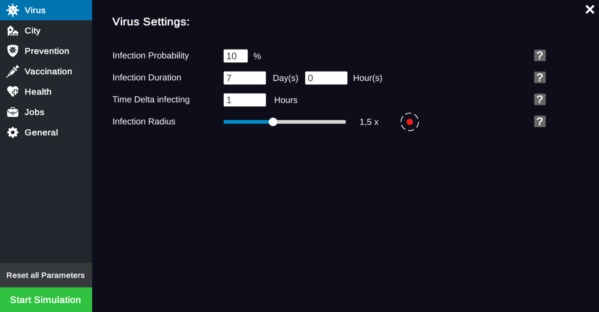

  

<h2 align="center">EpiSim</h3>

  An easy to use agent based pandemic simulation.

  <a id="raw-url" href="https://raw.githubusercontent.com/FaSeiler/EpiSim/master/EpiSim.zip">Download</a>

# About

This application was developed as part of a bachelor thesis in the course of study Computer Science - Game Engineering at the University of Applied Sciences Kempten.

EpiSim is an agent-based real-time simulation of pandemics that allows users to simulate various infectious diseases, as well as prevention measures and vaccination scenarios, and to collect data regarding the occurrence of infections. Based on this data, the measures taken to combat the virus can be analyzed and their impact assessed. To do this, the system uses intelligent agents that move around a three-dimensional stylized city. Agents have daily routines where they visit different locations in the city, potentially infecting other agents. Throughout the simulation, the agents and their movement in the city can be tracked. The resulting pandemic-relevant data is visualized in real time via diagrams and graphical user interfaces.

The aim of this work is not to depict and simulate a real infection event, such as that of the Covid-19 pandemic, but rather to create a basic understanding of the topic. Therefore, no conclusions should be drawn on the use of real prevention measures to contain a virus. This simulation is for demonstrational and educational purposes only.

For further questions, please contact fabian.seiler@outlook.de

© 2021 Fabian Seiler All Rights Reserved

# Images

